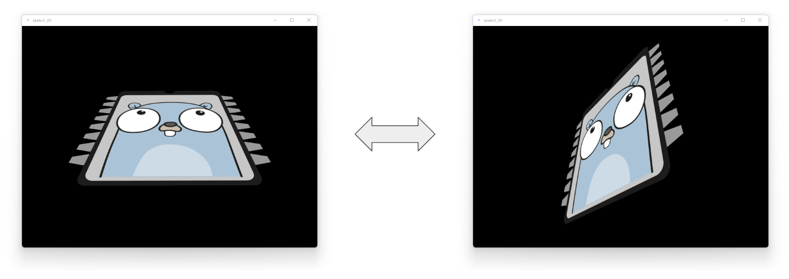
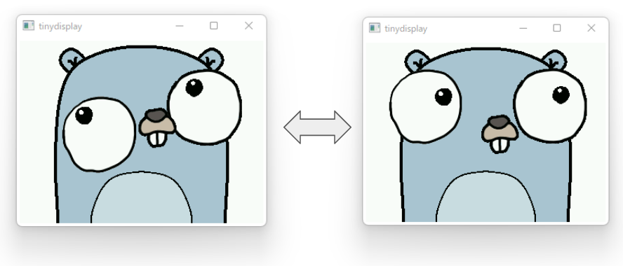

# 基礎から学ぶ TinyGoの組込み開発

高砂正哲が執筆した「基礎から学ぶ TinyGoの組込み開発」 (C&R研究所) のサポートサイトです。
質問や誤記などがある場合は本ページの Issue もしくは Twitter で受け付けています。

## 書籍情報

* C&R (紙) : https://www.c-r.com/book/detail/1477
* Amazon (紙、Kindle) : https://www.amazon.co.jp/dp/4863544006
* 本の森 (紙、PDF、EPUB) : https://book.mynavi.jp/manatee/c-r/books/detail/id=134168


各節まで含めた目次はこちら。

* [目次](./toc.md)

## Twitter

Twitter に投稿する時の hashtag は `#tinygo` と `#tinygobook` を使ってください。

* Twitter : [tinygo OR #tinygo OR @tinygolang OR #tinygobook](https://twitter.com/search?q=tinygo%20OR%20%23tinygo%20OR%20%40tinygolang%20OR%20%23tinygobook&src=typed_query&f=live)

## よくある質問と回答

### tinygo flash に失敗します

2 章 P.31 に従い (リセット x 2 で) ブートローダーに入れてから `tinygo flash` してみてください。
それでも改善しない場合は、 `tinygo build -o out.uf2` のようにして uf2 ファイルを作ってから手動で書き込みしてください。

## 正誤表

誤記等を見つけた場合は、 Issue もしくは Twitter で教えてください。

## Demos

デモアプリケーションはこちら。
Wio Terminal + TinyGo 0.26 で動作を確認しています。

### Wio Terminal Tracker

LIS3DH から得た情報を用いて、パソコン上の画像の傾きを制御する Demo です。



* [./wioterminal/tracker/](./wioterminal/tracker/)

```
$ tinygo flash --target wioterminal --size short ./wioterminal/tracker/
   code    data     bss |   flash     ram
  54496    1500    6260 |   55996    7760
```

注意) `-opt z` 以外でビルドすると、I2Cデータの受け取りに失敗します  

### Gopher福笑い

十字キーなどを使って目と口の位置を自由に動かすことができる Demo です。
面白い顔を作って Twitter に投稿してください。



* [./wioterminal/fukuwarai](./wioterminal/fukuwarai/)

```shell
$ tinygo flash --target wioterminal --size short --opt 2 ./wioterminal/fukuwarai/
   code    data     bss |   flash     ram
 447876     356  180480 |  448232  180836
```

注意) 実行速度を高速化するため `-opt 2` でビルドすることを推奨します  

### 各種リンク

* https://tinygo.org/
    * https://tinygo.org/docs/reference/microcontrollers/wioterminal/
* Seeed
    * https://wiki.seeedstudio.com/Wio-Terminal-Getting-Started/ (TinyGo ではなく Arduino 情報)
    * https://wiki.seeedstudio.com/jp/Wio-Terminal-Getting-Started/ (TinyGo ではなく Arduino 情報)
* [sago35の日記 - Hatena Blog](https://sago35.hatenablog.com/)
    * [TinyGo 0.26 で遊べるマイコンボード一覧 - Hatena Blog](https://sago35.hatenablog.com/entry/2022/10/05/083000)
* [github.com/sago35/tinygo-workshop](https://github.com/sago35/tinygo-workshop)
    * Go Conference 2021 Autumn 内の Wio Terminal を使った TinyGo ハンズオン用の記事
    * ハンズオン時の動画: https://gocon.jp/2021autumn/sessions/workshop_a/
* [Wio Terminal で TinyGo プログラミングを始めよう - Qiita](https://qiita.com/sago35/items/92b22e8cbbf99d0cd3ef)
* Twitter : [tinygo OR #tinygo OR @tinygolang OR #tinygobook](https://twitter.com/search?q=tinygo%20OR%20%23tinygo%20OR%20%40tinygolang%20OR%20%23tinygobook&src=typed_query&f=live)

## 著者紹介

* 高砂正哲
    * GitHub: https://github.com/sago35
    * Twitter: [@sago35tk](https://twitter.com/sago35tk)
