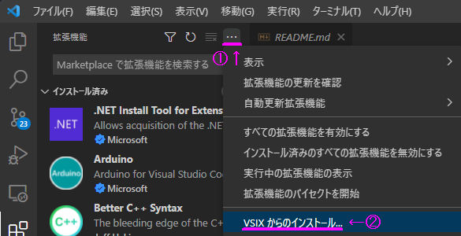

# Debug

[基礎から学ぶ 組込みRust](https://github.com/tomoyuki-nakabayashi/Embedded-Rust-from-Basics/tree/main/debug) でデバッガーを作っている場合、同じものを TinyGo で使うことができます。
また同様に CMSIS-DAP でデバッグする環境を持っている場合は、そのまま TinyGo (tinygo gdb) でデバッグすることができます。

## XIAO RP2040 を CMSIS-DAP Debugger にする

XIAO RP2040 を CMSIS-DAP 対応デバッガーにするための UF2 は以下にあります。

* [./rust-dap/rust-dap-xiao-rp2040.a992409.uf2](./rust-dap/rust-dap-xiao-rp2040.a992409.uf2)

ソースコード、ピン配置等は以下にあります。

* https://github.com/ciniml/rust-dap
    * https://github.com/ciniml/rust-dap/tree/main/boards/xiao_rp2040

## OpenOCD

Wio Terminal をデバッグする場合、以下の OpenOCD を使用することが出来ます。

* https://github.com/xpack-dev-tools/openocd-xpack/releases


## tinygo gdb

デバッガーを以下から入手してください。

* https://developer.arm.com/downloads/-/gnu-rm

apt や brew でもインストールできます。

```shell
# ubuntu など
$ sudo apt install gdb-multiarch

# macOS
$ brew tap ArmMbed/homebrew-formulae
$ brew install arm-none-eabi-gcc
```

## VSCode から Debug する

以下の PR で TinyGo の VSCode 拡張にデバッグ機能の追加を作成中です。
ビルド済みバイナリもあるので、是非使ってみて下さい。

* https://github.com/tinygo-org/vscode-tinygo/pull/4
    * [vscode-tinygo-0.4.0-dev1.vsix.zip](https://github.com/tinygo-org/vscode-tinygo/files/8890629/vscode-tinygo-0.4.0-dev1.vsix.zip)


### インストール方法

上記の `vscode-tinygo-0.4.0-dev1.vsix.zip` をダウンロードして `拡張機能＞①メニュー＞VSIX からのインストール` からインストールしてください。



### 使い方

前提として `tinygo gdb` が動作する必要があります。
以下のコマンドを実行して `(gdb)` というプロンプトが表示される事、そのプロンプトに `continue` と入力してプログラムが開始されることを確認してください。  
もしうまく動かない場合は、デバッガーの準備 (XIAO RP2040 等)、 OpenOCD および gdb のセットアップを再度確認してください。  

```
$ tinygo gdb --target wioterminal --programmer cmsis-dap examples/blinky1
```

VSCode で TinyGo のプログラムを開いた後、コマンドパレットに `TinyGo target` と入力して `wioterminal` を選択してください。  
その後、 `実行＞デバッグの開始` を実行するとビルドが実施されデバッガーが立ち上がります。  
`デバッグの開始` を選択する時点で、 main package のファイルを開いている必要があることに注意。  


